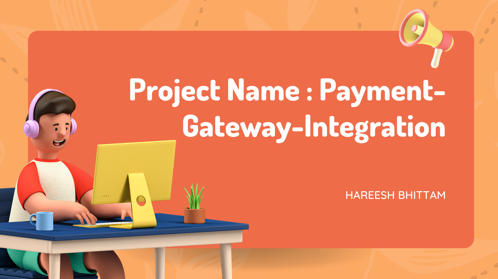
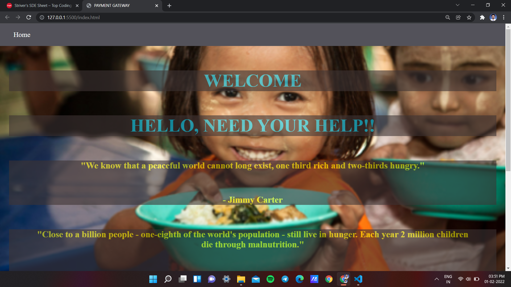
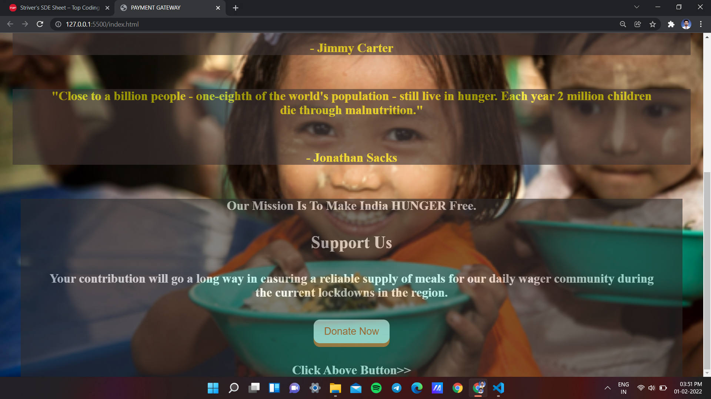
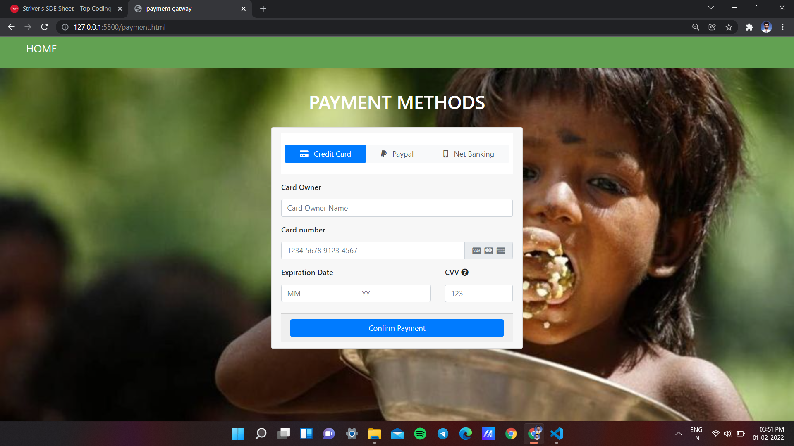
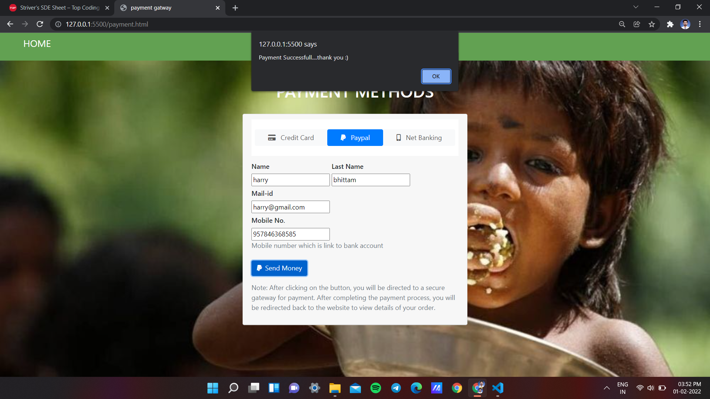
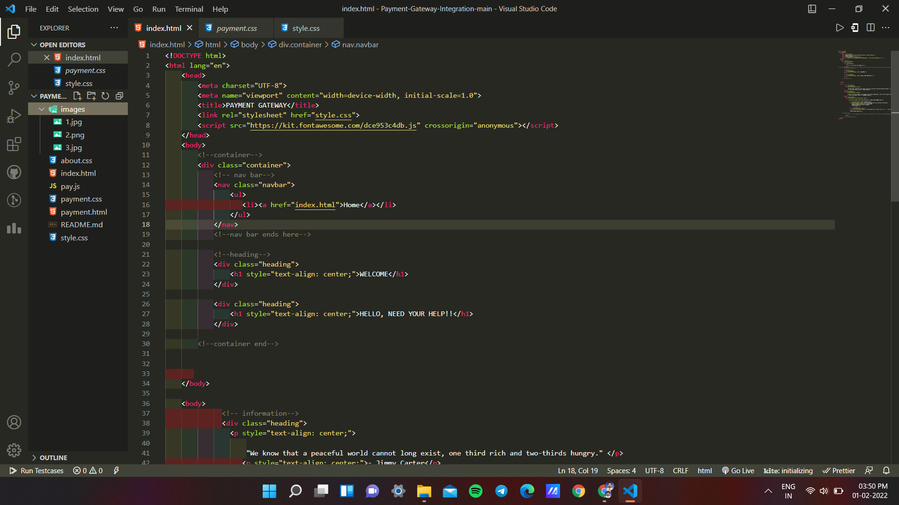
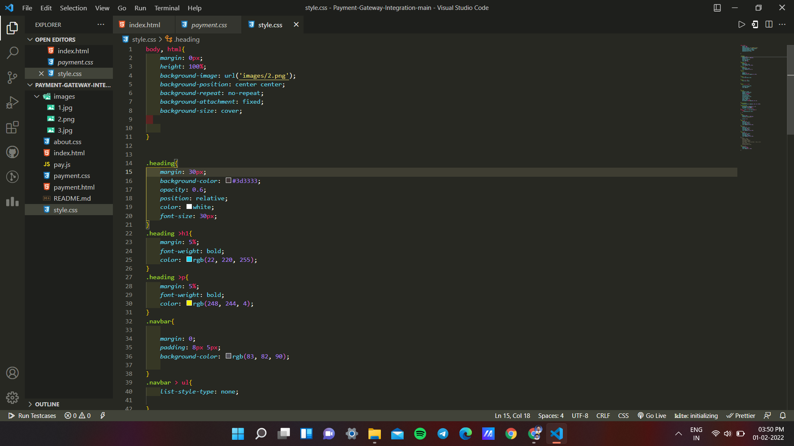
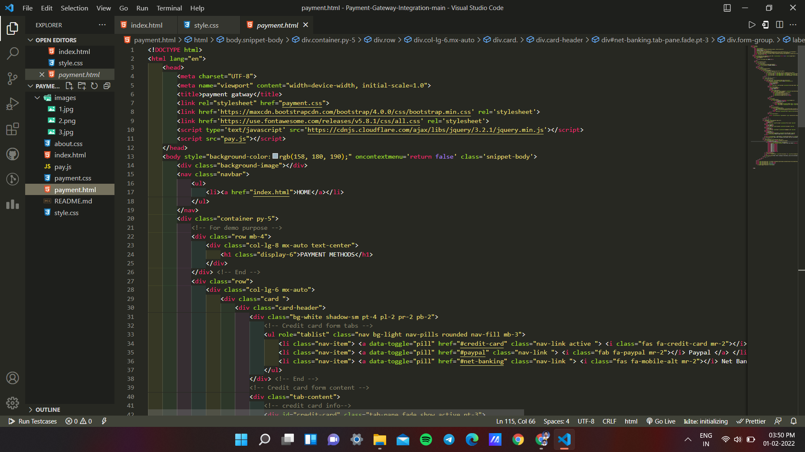
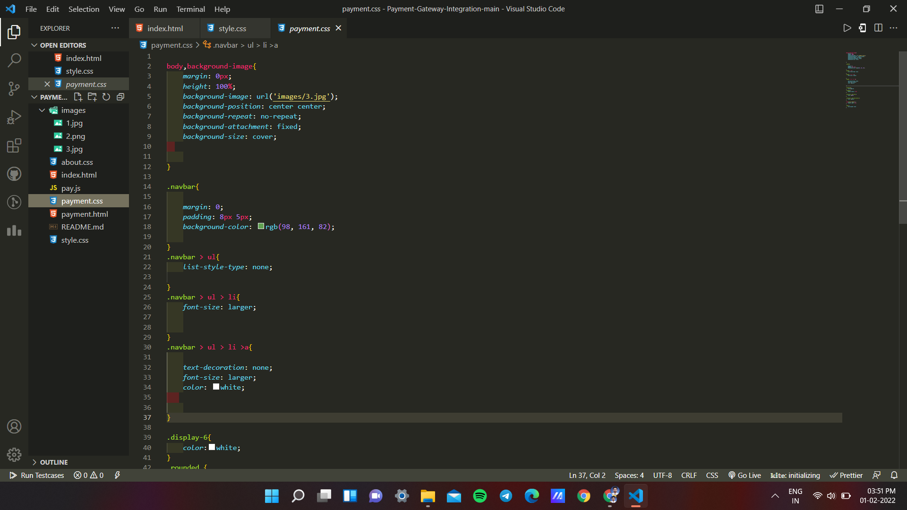

# SPARK FOUNDATION INTERNSHIP PROJECT

## Project Name- Payment-Gateway-Integration

## Resources used:
   - HTML
   - CSS
   - JavaScript

## Click Here : 
- https://hareesh108.github.io/Payment-Gateway-Integration/

## Please watch this project demo and explanation video :
- Click Above Thumbnail

## Problem Statement/Opportunity :
- Create a simple dynamic website which has the following specs.
- Start with creating a dummy data in database for upto 10 customers. Database options: Mysql, Mongo, Postgres, etc. Customers table will have basic fields such as name, email, current balance etc. Transfers table will record all transfers happened.
- Flow: Home Page > View all Customers > Select and View one Customer > Transfer Money > Select customer to transfer to > View all Customers.
- No Login Page. No User Creation. Only transfer of money between multiple users.

## Below you will find sample images :)

### OVERVIEW

### CODE

### THANK YOU SO MUCH

